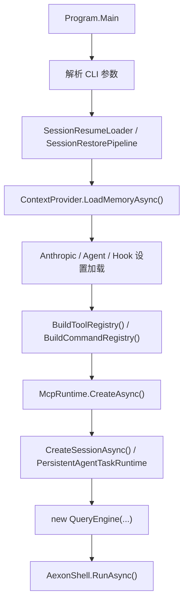

# Aexon 实现解析

## 先说现在这个项目在做什么

Aexon 不是“照着 Claude Code 换个语言重写 UI”，而是优先把 Claude Code 里最核心、最有研究价值的内核搬到 C#：

- REPL 和命令行入口
- QueryEngine 主循环
- 工具注册、权限、执行
- `CLAUDE.md` 风格上下文
- transcript 持久化与恢复
- 长上下文压缩

当前主路径已经能跑通一个完整的 agentic coding loop，但范围依然是“内核优先、能力收敛”的实现，不是 Claude Code 的全量等价替身。

## 当前主路径的代码分布

就当前 CLI 实际会走到的路径来说，最重要的是这几块：

```text
src/
├── Aexon.Cli/
│   └── Program.cs
├── Aexon.Core/
│   ├── Agents/
│   ├── Query/
│   ├── Context/
│   ├── Hooks/
│   ├── Mcp/
│   ├── Tools/
│   ├── Permissions/
│   ├── Storage/
│   ├── Compaction/
│   ├── Commands/
│   └── Messages/
├── Aexon.Tools/
│   ├── Web/
│   ├── AgentTool.cs
│   ├── BashTool.cs
│   ├── FileReadTool.cs
│   ├── FileWriteTool.cs
│   ├── FileEditTool.cs
│   ├── GlobTool.cs
│   └── GrepTool.cs
└── Aexon.Commands/
    └── BuiltinCommands.cs
```

测试主要集中在：

- `tests/Aexon.Core.Tests/Runtime`
- `tests/Aexon.Core.Tests/Storage`
- `tests/Aexon.Core.Tests/Compaction`
- `tests/Aexon.Core.Tests/Foundations`

## 程序启动是怎么接起来的

入口是 `src/Aexon.Cli/Program.cs`。

它做的事情很实在，按顺序是：

1. 解析 CLI 参数
2. 如果指定了 `--continue` 或 `--resume`，先恢复旧会话
3. 计算工作目录和模型
4. 创建 `ContextProvider` 并加载 memory 文件
5. 读取 Anthropic 配置、agent 配置、hook 配置
6. 组装 `ToolRegistry` 和 `CommandRegistry`
7. 连接 `settings.json` 里声明的 MCP server，并把它们的工具动态注册进来
8. 创建 Anthropic SDK client、transcript session 和 agent runtime
9. 用这些依赖初始化 `QueryEngine`
10. 进入 `AexonShell.RunAsync(...)`

用图看更直观：



这里有两个实现特点：

- 恢复逻辑在进入 QueryEngine 之前就做完了，所以 QueryEngine 一启动就拿到完整历史。
- transcript session 和 QueryEngine 是分开的，方便继续做 fork session、metadata、resume。

### 配置文件是怎么找的

Anthropic 配置现在不是只认环境变量了，主路径会按这个顺序找：

1. `ANTHROPIC_API_KEY`
2. `<workingDirectory>/appsettings.secrets.json`
3. `<workingDirectory>/appsettings.json`
4. `<AppContext.BaseDirectory>/appsettings.secrets.json`
5. `<AppContext.BaseDirectory>/appsettings.json`

另外，hooks 和 MCP 复用同一套 `settings.json` 寻址逻辑，默认会依次查：

- `~/.claudesharp/settings.json`
- `~/.claude/settings.json`
- `<workingDirectory>/.claudesharp/settings.json`
- `<workingDirectory>/.claude/settings.json`

如果用户传了 `--settings <path>`，就直接只读那一个文件。

## REPL 壳层做了什么

`Program.cs` 里内嵌的 `AexonShell` 很轻，主要负责：

- 打 banner
- 区分 slash command 和普通输入
- 消费 `QueryEngine.SubmitMessageAsync(...)` 产出的事件流
- 在权限事件出现时同步询问用户

这层不持有业务规则，只是事件渲染器和输入分发器。

这点和 Claude Code 的思路一致：核心状态留在 QueryEngine，UI 只消费事件。

## QueryEngine 是这个项目的心脏

核心文件：

- `src/Aexon.Core/Query/QueryEngine.cs`
- `src/Aexon.Core/Query/QueryEngineConfig.cs`
- `src/Aexon.Core/Query/QueryEvents.cs`
- `src/Aexon.Core/Messages/ConversationMessage.cs`

### 它维护了哪些状态

`QueryEngine` 内部主要维护：

- `_messages`：当前活动消息链
- `_totalUsage`：累计 token 用量
- `_sessionMetadata`：标题、标签、权限模式
- `_journal`：可选的 transcript 写入器
- `_toolRuntime`：工具执行编排器
- `_contextPressurePipeline`：上下文压力处理器

### 一轮提交怎么跑

`SubmitMessageAsync(...)` 的主循环基本是：

1. 把用户输入变成 `UserMessage`
2. 在发请求前先跑 `PrepareContextForTurnAsync(...)`
3. 让 `ContextProvider` 生成 system prompt
4. 把内部消息模型转换成 Anthropic SDK 的 message 结构
5. 读取工具定义，构造 Anthropic request
6. 默认走 `StreamAssistantTurnAsync(...)`，必要时回退到 `CollectAssistantTurnAsync(...)`
7. 把流里的文本、thinking、tool_use 逐步还原成内部事件和 content blocks
8. 把整条 assistant 消息写回 `_messages`
9. 如果没有工具调用，结束
10. 如果有工具调用，走 `ExecuteToolCallsAsync(...)`
11. 工具结果再作为 `tool_result` 用户消息写回消息链，继续下一轮

从形状上看，它已经是标准的 agentic loop。

### 目前和 Claude Code 的一个关键差别

现在默认主路径已经会走 streaming API：

- `UseStreamingApi = true` 时走 `Messages.WithRawResponse.CreateStreaming(...)`
- 按 SSE 事件把文本、thinking、tool_use 逐块还原成内部事件
- 同时仍然保留 `Messages.Create(...)` 的缓冲式回退路径

所以这版不再是“纯响应级返回再拆块”，而是已经有真正的流式主链路。和 Claude Code 的差距主要不在“有没有流式”，而在于流式执行细节、UI 联动、hook/fallback 之类的平台能力还没那么厚。

## 消息模型怎么设计的

核心文件是 `src/Aexon.Core/Messages/ConversationMessage.cs`。

这里做得比较干净：

- `ConversationMessage` 作为基类
- `UserMessage` / `AssistantMessage` / `SystemMessage` 作为具体类型
- `ContentBlock` 再往下拆成：
  - `TextBlock`
  - `ToolUseBlock`
  - `ToolResultBlock`
  - `ThinkingBlock`

这样做的好处是：

- 和 Anthropic 的内容块模型天然对齐
- transcript 序列化更稳定
- compaction 和 recovery 可以按 block 粒度做重写

## 系统提示和上下文是怎么拼出来的

核心文件：

- `src/Aexon.Core/Context/ContextProvider.cs`
- `src/Aexon.Core/Context/MemoryInstructionScanner.cs`
- `src/Aexon.Core/Markdown/FrontmatterParser.cs`
- `src/Aexon.Core/Query/ClaudeModelCatalog.cs`

### `ContextProvider`

`ContextProvider.BuildSystemPromptAsync(...)` 当前会按顺序拼：

1. 身份提示
2. 环境信息
3. 每个工具自己的 prompt
4. git 状态快照
5. memory 文件内容
6. 自定义 / 追加系统提示

这个设计直接对应 Claude Code 的思路：工具说明不硬编码在一个超长模板里，而是让每个工具自己负责自己的 prompt。

### `MemoryInstructionScanner`

它会从工作目录一路向上扫描：

- `CLAUDE.md`
- `.claude/CLAUDE.md`
- `.claude/rules/*.md`
- `CLAUDE.local.md`

扫描顺序也保留了 Claude 风格：越靠近当前目录的规则，优先级越高。

### `FrontmatterParser`

这块不是普通 YAML 解析，而是专门为了 Claude 风格规则文件做了增强：

- 先抽 frontmatter
- YAML 失败时自动补引号重试
- 支持 `paths` 拆分
- 支持 brace expansion
- 支持正整数和布尔值解析

### `ClaudeModelCatalog`

模型映射不再是简单 alias 字典，而是一个统一目录：

- stable id
- source canonical id
- 各 provider id
- 人类可输入 alias

这样后面无论是 `/model`、provider 适配，还是 allowlist，都有统一入口。

## 工具系统现在怎么实现

核心文件：

- `src/Aexon.Core/Tools/ITool.cs`
- `src/Aexon.Core/Tools/ToolRegistry.cs`
- `src/Aexon.Core/Tools/ToolRuntime.cs`
- `src/Aexon.Core/Tools/StreamingToolExecutor.cs`
- `src/Aexon.Tools/*.cs`

### `ITool` 协议

现在的工具协议已经把 Claude Code 的核心抽象保住了：

- `GetDescriptionAsync()`：发给模型看的描述
- `GetInputSchema()`：工具输入 schema
- `GetPromptAsync(...)`：系统提示里的工具说明
- `ValidateInputAsync(...)`
- `CheckPermissionsAsync(...)`
- `ExecuteAsync(...)`
- `IsReadOnly(...)`
- `IsConcurrencySafe(...)`
- `MaxResultSizeChars`

也就是说，工具不只是“一个执行函数”，而是“描述 + 权限 + 运行时行为”的集合。

### `ToolRegistry`

`ToolRegistry` 负责：

- 注册工具和别名
- 返回启用工具
- 生成 Anthropic API 所需的 tool definitions

当前内置注册的是：

- `Bash`
- `Read`
- `Write`
- `Edit`
- `Glob`
- `Grep`
- `WebFetch`
- `WebSearch`
- `Agent`

另外还注册了 `AgentStatus`、`AgentStop`、`AgentWait` 这组三个内部工具，但它们默认不暴露给模型，主要是复用同一套 agent runtime 给 CLI 的 `/agents` 命令。

### `StreamingToolExecutor`

虽然名字叫 streaming，但这版更准确地说是“批量工具运行时”：

- 先校验输入
- 再做权限编排
- 按 `IsConcurrencySafe(...)` 分成并发批次和串行批次
- 并发批次 `Task.WhenAll(...)`
- 串行批次按顺序执行
- 执行结果统一收敛成 `ToolRunUpdate`

它已经把 QueryEngine 里的工具调度抽离成独立运行时，这对后面升级成真正流式执行很重要。

### 各工具当前的实现风格

`src/Aexon.Tools/` 里每个工具都比较克制，优先保证主链路能用：

- `BashTool.cs`
  - 真正起 shell 进程执行
  - 捕获 stdout / stderr
  - 有超时
  - 用 `BashCommandClassifier` 做读写分类
- `FileReadTool.cs`
  - 支持 offset / limit
  - 文本按行号输出
  - 图片做简化读取
- `FileWriteTool.cs`
  - 创建或覆盖文件
- `FileEditTool.cs`
  - 精确字符串替换
  - 要求唯一匹配
- `GlobTool.cs`
  - 用 `Microsoft.Extensions.FileSystemGlobbing`
- `GrepTool.cs`
  - 用 .NET 正则递归搜索
- `WebFetchTool.cs`
  - 抓已知 URL
  - 做权限域名判断
  - 抽简化文本返回
- `WebSearchTool.cs`
  - 做网页发现，不负责抓已知 URL
  - 当前默认后端是 DuckDuckGo HTML
  - 会根据模型/provider 能力决定是否启用
- `AgentTool.cs`
  - 启动只读子代理做窄任务调查
  - 可以前台等结果，也可以后台排队运行
  - 后台运行状态落到 agent runtime，再交给 `/agents` 这组命令管理

这套工具目前的取舍很明确：先做通用内核，再逐步贴近 Claude Code 的高阶行为。

## 权限系统怎么实现

核心文件：

- `src/Aexon.Core/Permissions/PermissionSystem.cs`
- `src/Aexon.Core/Permissions/PermissionRules.cs`
- `src/Aexon.Tools/Shell/BashCommandClassifier.cs`

### 权限模式

当前支持：

- `Default`
- `Plan`
- `Auto`
- `Bypass`

### 权限检查顺序

`DefaultPermissionChecker.CheckAsync(...)` 的顺序是：

1. 查 deny 规则
2. 跑工具自己的 `CheckPermissionsAsync(...)`
3. 如果是 bypass，直接放行
4. 查 allow 规则
5. 查 ask 规则
6. Plan / Auto 下的只读操作自动放行
7. Auto 模式下全部放行
8. 工具自己明确 allow 的放行
9. 其余进入 Ask

这个顺序保留了 Claude Code 的总体思路。

### 权限规则

`PermissionRuleMatcher` 现在支持三种匹配：

- 精确匹配：`Bash(git status)`
- 前缀匹配：`Bash(git:*)`
- 通配符匹配：`Read(/tmp/*.md)`

目标值会从 `command`、`file_path`、`path` 这几类常见字段里抽出来。

### Bash 分类器

`BashCommandClassifier` 做的是启发式安全分类：

- 常见只读命令
- 常见写命令
- 明显破坏性命令
- `git` 子命令细分
- 顶层重定向识别
- `sed -i`、`perl -i` 这类就地改文件识别

因此现在的 shell 权限不再只是“Bash 一律 ask”，而是有了基本的安全语义。

## transcript、恢复和会话元数据

核心文件：

- `src/Aexon.Core/Storage/TranscriptStore.cs`
- `src/Aexon.Core/Storage/ConversationRecovery.cs`
- `src/Aexon.Core/Storage/SessionRestorePipeline.cs`
- `src/Aexon.Core/Storage/ConversationSessionMetadata.cs`

### 持久化格式

当前实现是：

- 根目录：`~/.claudesharp/sessions/<sessionId>/`
- transcript：`transcript.jsonl`
- manifest：`manifest.json`

写入时区分两种 record：

- `message`
- `metadata`

manifest 里保存：

- session id
- created / updated 时间
- working directory
- model
- title
- tags
- mode
- current leaf message id

### 为什么恢复不是“把 JSONL 顺序读出来”

因为 Aexon 也支持：

- checkpoint compaction
- microcompact
- reset head
- metadata 增量

所以恢复要做几件事：

1. 从 `CurrentLeafMessageId` 反向回溯 parent 链
2. 如果有 checkpoint，优先从 checkpoint 重建活动消息链
3. 把 microcompact 记录重新应用到消息上
4. 清掉空 assistant message 或无意义残片
5. 重新汇总 usage 和 metadata

`ConversationRecovery` 干的正是这件事。

## 长上下文治理是怎么接进来的

核心文件：

- `src/Aexon.Core/Compaction/ContextPressurePipeline.cs`
- `src/Aexon.Core/Compaction/AutoCompactPolicy.cs`
- `src/Aexon.Core/Compaction/MicroCompactor.cs`
- `src/Aexon.Core/Compaction/SessionMemoryCompactor.cs`
- `src/Aexon.Core/Compaction/ConversationCompactor.cs`
- `src/Aexon.Core/Compaction/PromptTokenEstimator.cs`

### 1. 压力判断

`HeuristicAutoCompactPolicy` 会先用 `PromptTokenEstimator` 估算上下文 token，再根据阈值决定：

- `None`
- `TryMicrocompact`
- `FullCompact`

### 2. 执行顺序

`DefaultContextPressurePipeline.Prepare(...)` 的顺序是：

1. 先判断要不要 compact
2. 如果命中 warning/blocking，先尝试 microcompact
3. 如果还是太大，再尝试 session memory compact
4. 还不够，再做 conversation compact

这条路径是逐级加重的，不是一上来就总结整段会话。

### 3. 各压缩器分别做什么

- `MicroCompactor`
  - 清旧 tool result
  - 清旧 thinking
  - 保留消息骨架
- `SessionMemoryCompactor`
  - 折叠更早消息
  - 保留最近消息原文
  - 生成 session memory summary
- `ConversationCompactor`
  - 生成更传统的 compact summary
  - 通过 `ConversationRewriter` 保证边界不破坏 tool 协议

### 4. QueryEngine 里怎么落地

每轮请求开始前，`QueryEngine.PrepareContextForTurnAsync(...)` 会：

- 跑 `ContextPressurePipeline`
- 如果有变化，先把 `_messages` 改写
- 再通过 `ConversationJournal` 把 checkpoint 或 microcompact 记录写进 transcript
- 最后向 UI 发 `ContextCompactionEvent`

这意味着压缩不是“内存里偷偷做一下”，而是会被持久化，下一次 resume 还能接上。

## 命令系统现在覆盖了什么

核心文件：

- `src/Aexon.Core/Commands/CommandSystem.cs`
- `src/Aexon.Commands/BuiltinCommands.cs`

当前命令集中已经有四类：

- 基础交互
  - `/help`
  - `/clear`
  - `/exit`
  - `/model`
  - `/cost`
- 会话管理
  - `/session`
  - `/mode`
  - `/title`
  - `/tag`
- 上下文整理
  - `/compact`
  - `/session-memory`
  - `/pcompact`
  - `/microcompact`
- 子代理管理
  - `/agents`
  - `/agents summary`
  - `/agents list`
  - `/agents wait`
  - `/agents tail`
  - `/agents prune`
  - `/agents stop`

也就是说，这个项目当前已经不只是“发 prompt 的 REPL”，而是已经有了会话管理、上下文整理和后台子代理管理这几条比较完整的操作面。

## 这个项目当前还没做满的地方

如果和 `claude-code/` 快照对照，当前 Aexon 还明显收敛在“内核已经跑通，但平台能力还没做满”的阶段，主要缺口包括：

- 更完整的工具执行钩子和进度事件
- 更成熟的流式 UI 和异常恢复细节
- 更完整的 MCP 能力
  - 现在已经能从 `settings.json` 动态接 stdio MCP 工具
  - 但 transport、鉴权、生态兼容度还远不如原版
- 更完整的子代理 / 团队代理
  - 现在已经有只读子代理、后台运行和 `/agents` 管理
  - 但离 team/workflow 那种多角色协作还差很远
- bridge、remote、desktop、IDE 集成
- 更丰富的 UI 和诊断界面
- 更复杂的 shell / sandbox 安全模型

不过从结构上看，很多基础抽象已经到位了：

- `IToolRuntime`
- transcript + recovery
- compaction pipeline
- permission rules
- model catalog

这意味着后续扩展不必推倒重来，而是继续把 Claude Code 的复杂能力往现有抽象里接。

## 怎么理解当前这版 Aexon

一句话概括：

它已经不是“Claude Code 的概念演示”，而是一版把 Claude Code 核心内核翻译成 .NET 风格实现的工程化骨架。

它现在最像 Claude Code 的地方是：

- QueryEngine 主循环
- 工具协议
- 权限规则
- memory 文件扫描
- transcript / resume
- 上下文压缩

它现在和 Claude Code 差距最大的地方是：

- 流式执行的完整度
- 扩展系统规模
- 平台化能力
- UI 和外围生态

所以更准确的定位是：Aexon 现在已经把 Claude Code 最核心的“代理执行内核”翻到了 .NET 世界里，接下来要补的，是让这套内核逐步长出更完整的平台能力。
